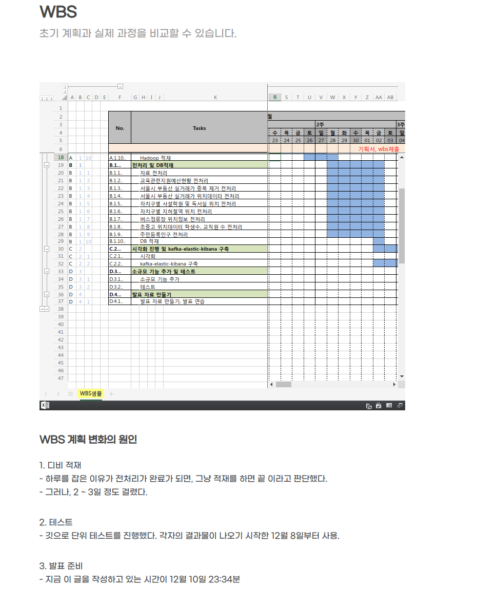
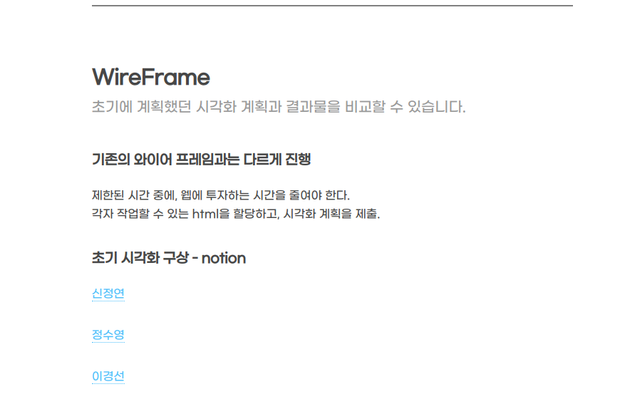
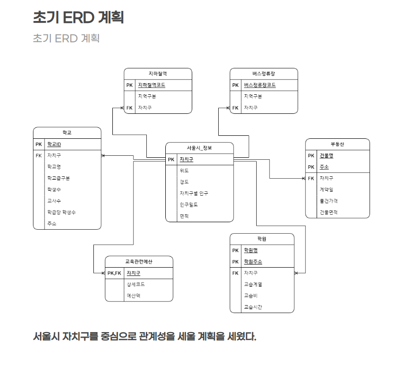
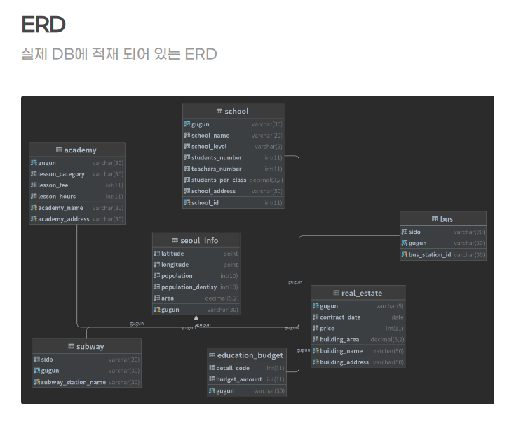
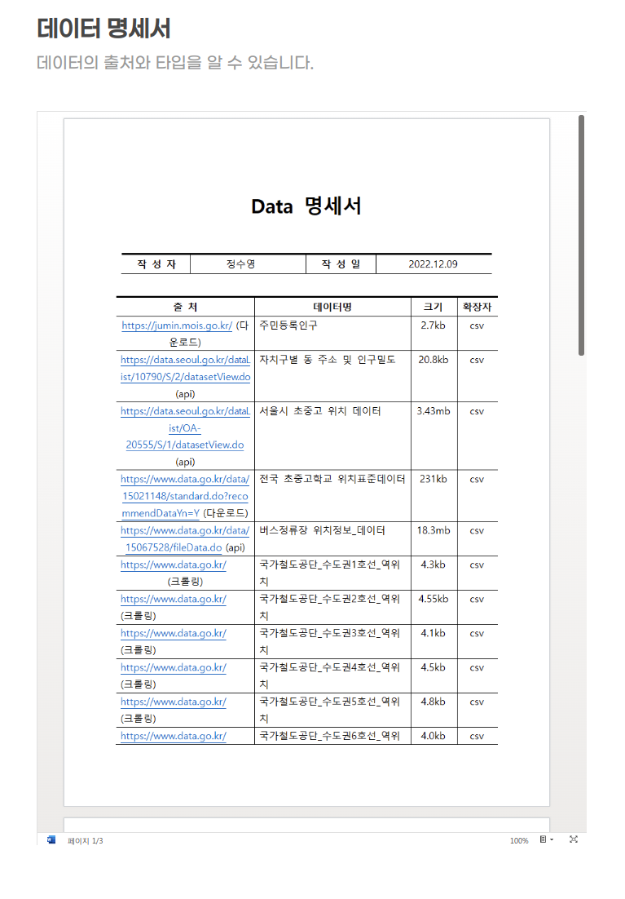
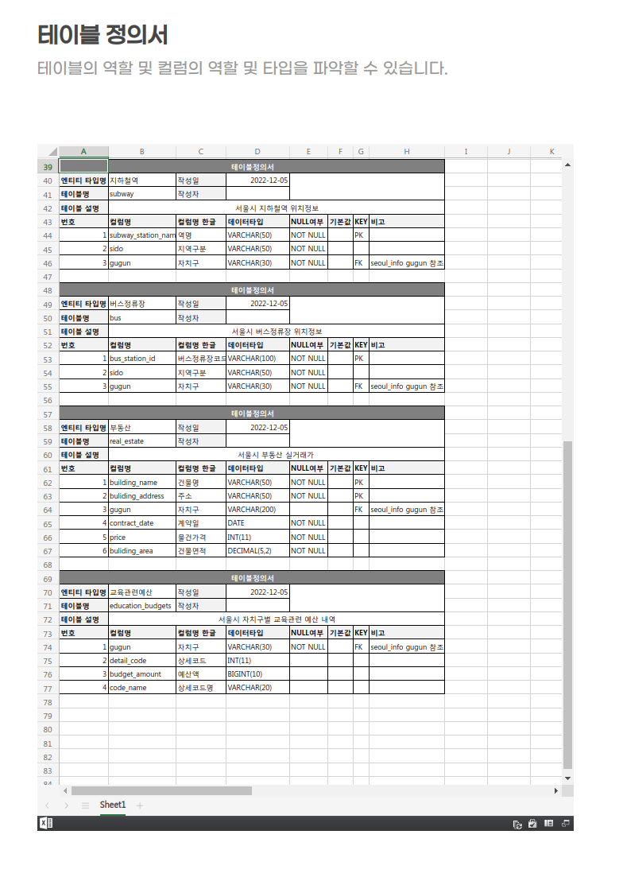
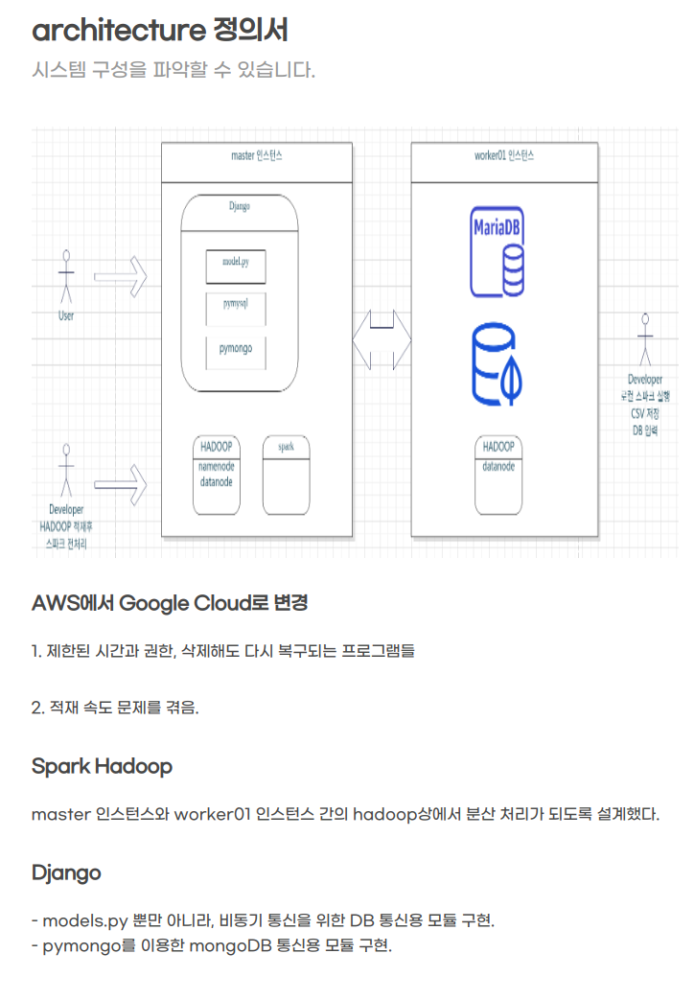

# 수도권 신설 학교를 위한 학생수 예측 데이터 셋
- 팀장: 주우진
- 팀원: 정수영 김남규 이경선 신정연

## 프로젝트 진행 의의:
- 실제로 유의한 변수를 찾고, 가설을 작성하고 기각하는 과정이 아닌, 어떻게 기획을 했고 완성을 했는 가에 대해서 집중해서 설명을 할 겁니다.
- 실제 시각화 결과들은 최대한 담백하게 보여주고 넘어갈 예정입니다.

## 주제 선정의 이유:
- 우리 모두 출산율이 적다는 것을 알고 있습니다. 그렇다면, 학교 수도 자연스럽게 줄어야 하지만, 신규로 개교하는 학교가 있다.
- 정부기관에서 학생 수를 예측을 했고, 그에 따른 결과가 신규 학교 개교.
- 학생수를 예측한 논문들의 컬럼들을 기준으로 데이터를 수집을 하여, 옳고 그름을 판단할 수 있다.
- 학생수 예측에 중요한 컬럼을 분석하여, 추후 정책에 도움을 줄 수 있어서 주제를 선정했습니다.

## 프로젝트 초기 기획과 시각화 방안

### 프로젝트 기획서

### WBS

### wireFrame

## 데이터 명세와 적재

### 초기 ERD 계획

- 서울시 중심으로 데이터 수집이 결정되었으므로 서울시 자치구를 중심으로 데이터를 관리를 했습니다.

### ERD

### MongoDB

- 하둡에 적재한 csv파일을 읽어 spark를 통해 GeoQuery가 가능한 형태로 전처리 후 적재

### DATA 명세서

### 테이블 정의서

### 아키텍처 정의서

## 지도
